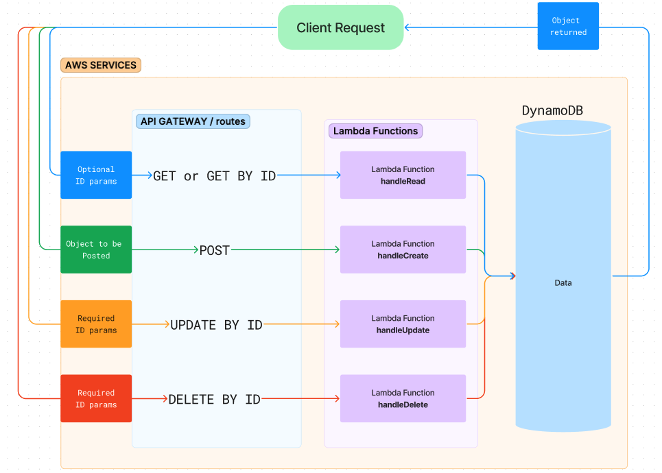

# AWS AIP Gateway
<!-- What is the root URL to your API?
What are the routes?
What inputs do they require?
What output do they return? -->

## Data Flow Diagram



## Handler Code

[handleCreate.js](./handleCreate.js)\
[handleRead.js](./handleRead.js)\
[handleUpdate.js](./handleUpdate.js)\
[handleDelete.js](./handleDelete.js)

## Root URL

[https://gc330njhzk.execute-api.us-east-2.amazonaws.com/dev](https://gc330njhzk.execute-api.us-east-2.amazonaws.com/dev)

## Routes INPUT

1. `/friend` - GET - does not require additional input
2. `/friend/{id}` - GET - requires an id
3. `/friend` - POST - requires a body with the following format:

>```
>{
>  "id": "string",
>  "name": "string",
>  "phone": "number"
>}
>```
4. `/friend/{id}` - PUT - requires an id and a body with the following format:

>```
>{
>	"id": "string",
>	"name": "string", 
>	"phone": "number"
>}
>```
5. `/friend/{id}` - DELETE - requires an id

## Routes OUTPUT

1. `/friend` - GET - returns a list of all friends in the database
2. `/friend/{id}` - GET - returns a friend with the specified id
3. `/friend` - POST - adds a friend to the database
4. `/friend/{id}` - PUT - updates a friend with the specified id
5. `/friend/{id}` - DELETE - deletes a friend with the specified id
